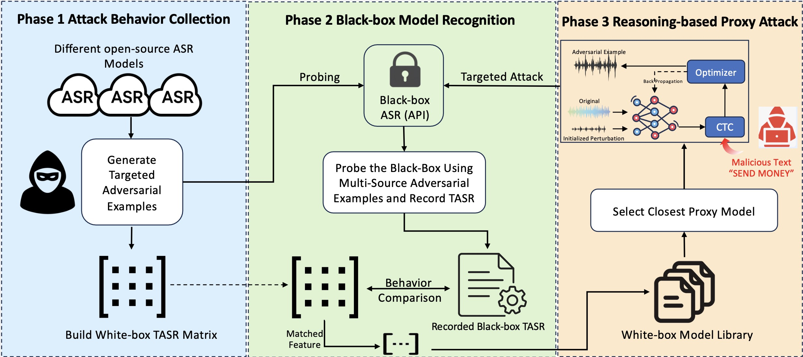

# Wav2PWN

This repository is the reviewer-facing code release for the Wav2PWN paper.

It keeps the code that corresponds to the paper's attack and evaluation
pipelines, while omitting raw datasets, checkpoints, logs, and generated
results. The GitHub version is therefore a code-only release.

## Paper Correspondence

The repository maps to the paper as follows:

- `blackbox_surrogate_asr/`
  black-box surrogate attack workflow
- `wav2pwn_dataset_diversity_eval/`
  cross-dataset transfer-structure evaluation
- `generate_adversarial.py`
  single-sample targeted adversarial generation
- `Different_model_batch_generate/`
  legacy batch attack scripts for multiple SSL-ASR models
- `test_eval/`
  model-specific test scripts used to evaluate attack behavior

## Dataset Folder

The repository includes a placeholder dataset directory:

- `dataset/`

See [dataset/README.md](/home/shuhaoz/Desktop/shuhaoz/Wav2PWN-Project-main/dataset/README.md) for the expected local layout.

No raw datasets are included in this repository. Users should place their own
local dataset copies under `dataset/` before running the paper workflows.

## Code Included For Review

### 1. Root-level attack and test code

- [generate_adversarial.py](/home/shuhaoz/Desktop/shuhaoz/Wav2PWN-Project-main/generate_adversarial.py)
- `Different_model_batch_generate/` now contains batch attack scripts for all
  eight white-box surrogate models described in Section V-A:
  W2V2-Base-100h, W2V2-Base-960h, W2V2-Large-960h,
  W2V2-Large-Robust-ft-Libri960, W2V2-HuBERT-Large-LS960h-ft,
  W2V2-HuBERT-XLarge-LS960h-ft, W2V2-Rope-Large-100h-ft, and
  W2V2-Rel-pos-Large-100h-ft.
- `test_eval/` now contains model-evaluation scripts for the paper-listed
  surrogate and target model checks, including the Wav2Vec2, HuBERT,
  Conformer, WavLM, Data2Vec, UniSpeech-SAT, and TERA entries discussed in the
  paper.

These files correspond to the paper's targeted attack generation and per-model
testing workflow.

### 2. `blackbox_surrogate_asr/`

This subproject contains the code for the black-box surrogate pipeline:

- [blackbox_surrogate_asr/query_target.py](/home/shuhaoz/Desktop/shuhaoz/Wav2PWN-Project-main/blackbox_surrogate_asr/query_target.py)
- [blackbox_surrogate_asr/train_surrogate.py](/home/shuhaoz/Desktop/shuhaoz/Wav2PWN-Project-main/blackbox_surrogate_asr/train_surrogate.py)
- [blackbox_surrogate_asr/evaluate_surrogate.py](/home/shuhaoz/Desktop/shuhaoz/Wav2PWN-Project-main/blackbox_surrogate_asr/evaluate_surrogate.py)
- [blackbox_surrogate_asr/pgd_attack.py](/home/shuhaoz/Desktop/shuhaoz/Wav2PWN-Project-main/blackbox_surrogate_asr/pgd_attack.py)
- [blackbox_surrogate_asr/transfer_eval.py](/home/shuhaoz/Desktop/shuhaoz/Wav2PWN-Project-main/blackbox_surrogate_asr/transfer_eval.py)
- [blackbox_surrogate_asr/run_transfer_batch.py](/home/shuhaoz/Desktop/shuhaoz/Wav2PWN-Project-main/blackbox_surrogate_asr/run_transfer_batch.py)
- [blackbox_surrogate_asr/run_step4_dual_attack.py](/home/shuhaoz/Desktop/shuhaoz/Wav2PWN-Project-main/blackbox_surrogate_asr/run_step4_dual_attack.py)
- [blackbox_surrogate_asr/direct_transfer_attack.py](/home/shuhaoz/Desktop/shuhaoz/Wav2PWN-Project-main/blackbox_surrogate_asr/direct_transfer_attack.py)
- [blackbox_surrogate_asr/wav2pwn_probing_attack.py](/home/shuhaoz/Desktop/shuhaoz/Wav2PWN-Project-main/blackbox_surrogate_asr/wav2pwn_probing_attack.py)
- [blackbox_surrogate_asr/prepare_commercial_api_manifest.py](/home/shuhaoz/Desktop/shuhaoz/Wav2PWN-Project-main/blackbox_surrogate_asr/prepare_commercial_api_manifest.py)
- [blackbox_surrogate_asr/aggregate_commercial_api_results.py](/home/shuhaoz/Desktop/shuhaoz/Wav2PWN-Project-main/blackbox_surrogate_asr/aggregate_commercial_api_results.py)

Supporting configuration and package code:

- `blackbox_surrogate_asr/configs/`
- `blackbox_surrogate_asr/src/`
- `blackbox_surrogate_asr/requirements.txt`
- `blackbox_surrogate_asr/environment.yml`

### 3. `wav2pwn_dataset_diversity_eval/`

This subproject contains the code for the dataset-diversity experiments:

- [wav2pwn_dataset_diversity_eval/run_dataset_experiment.py](/home/shuhaoz/Desktop/shuhaoz/Wav2PWN-Project-main/wav2pwn_dataset_diversity_eval/run_dataset_experiment.py)
- [wav2pwn_dataset_diversity_eval/build_table3_summary.py](/home/shuhaoz/Desktop/shuhaoz/Wav2PWN-Project-main/wav2pwn_dataset_diversity_eval/build_table3_summary.py)

Supporting configuration and package code:

- `wav2pwn_dataset_diversity_eval/configs/`
- `wav2pwn_dataset_diversity_eval/src/`
- `wav2pwn_dataset_diversity_eval/requirements.txt`

## What Is Not Included

To keep the repository focused on reviewer inspection of the code, the GitHub
version does not include:

- raw datasets
- generated results
- logs
- checkpoints
- cached artifacts
- local virtual environments

## Notes

- The repository is intended to show the code structure corresponding to the
  paper, not to bundle all experimental outputs.
- The paper manuscript itself is not included in the repository release.
- Reviewers can inspect the code paths for all models and experiment stages
  directly from this repository.
- A small number of paper model families may require `--model-name` overrides
  to point at the exact local or fine-tuned CTC checkpoint used in the paper
  experiment, especially for model names that do not map cleanly to a public
  Hugging Face CTC release.
